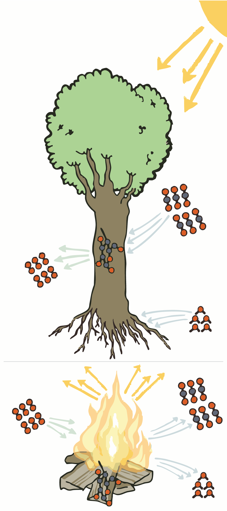
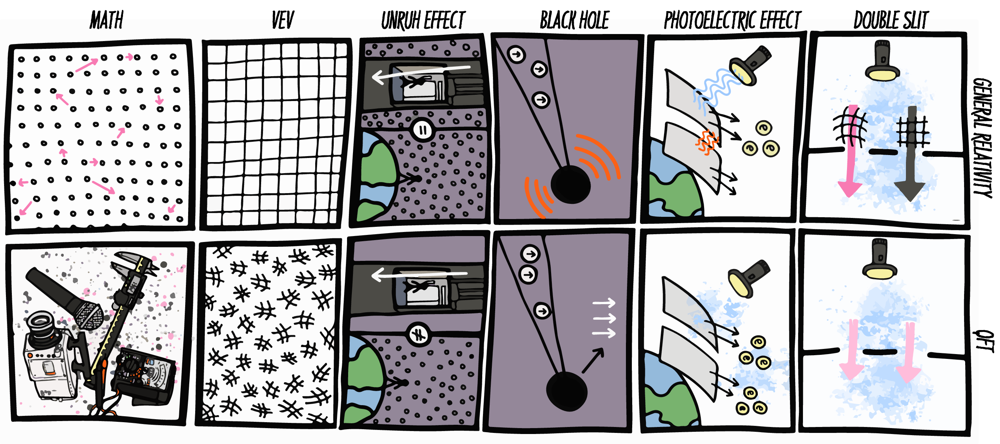

# Beyond Popular Science

**Fifty explorations at the boundary of mainstream science**

David H. Silver
&ensp;|&ensp; [ORCID 0000-0002-3071-304X](https://orcid.org/0000-0002-3071-304X)

Published by [Open Book Publishers](https://www.openbookpublishers.com/books/10.11647/obp.0526), Cambridge, UK — 3 April 2026

| | |
|---|---|
| **DOI** | [10.11647/OBP.0526](https://doi.org/10.11647/OBP.0526) |
| **ISBN (PDF)** | 978-1-80511-879-4 |
| **ISBN (Paperback)** | 978-1-80511-877-0 |
| **ISBN (Hardback)** | 978-1-80511-878-7 |
| **Licence** | [CC BY-NC 4.0](https://creativecommons.org/licenses/by-nc/4.0/) |

> Download the latest PDFs (print-ready, digital, preview) from the [**Releases**](https://github.com/silverdavi/beyond_popular_science/releases/tag/latest) page.

---

## About

This book contains 50 standalone chapters, each exploring a curious phenomenon at the boundary of physics, mathematics, cosmology, biology, computer science, history, and linguistics. Topics range from why gold is yellow (relativistic quantum chemistry) to whether the universe is a Boltzmann brain fluctuation; from the mathematics of gerrymandering to the slipperiness of ice; from Minecraft's Creeper bug to the incompatibility of quantum field theory and general relativity.

Every chapter was written, typeset, and compiled by the author in LaTeX. The full source — all `.tex` files, figures, compilation scripts, and the automated release pipeline — is in this repository.

## About the author

David H. Silver is an industrial researcher whose career bridges computer vision, computational biology, and science communication. He studied mathematics, computer science, and biology at the Technion — Israel Institute of Technology as a Rothschild Scholar, and was awarded a Microsoft Research PhD Fellowship for his doctoral work in computational biology at Cambridge, UK. Silver's peer-reviewed publications span computational biology (*Nature*, *PNAS*), computer vision (*IEEE TPAMI*), medical AI (*Human Reproduction*, *MIDL*), and entertainment analysis (*PLoS One*). He holds over a dozen patents in depth sensing, medical imaging, and generative AI.

---

## Example illustrations

Each chapter includes a full-page illustrated sidenote by Jess DG Hayes:

<p align="center">
  
  &emsp;&emsp;
  
</p>

<p align="center">
  <em>Left: Ch. 35 — From Air to Arbor (photosynthesis and carbon fixation).</em><br/>
  <em>Right: Ch. 36 — When Theories Collide (GR vs QFT in six thought experiments).</em>
</p>

---

## Chapter list

| # | Directory | Title |
|--:|-----------|-------|
| 1 | `01_GoldRelativity` | Relatively Yellow |
| 2 | `02_AcceleratingUniverse` | Dark Energies Are Pushing Us Apart |
| 3 | `03_BanachTarskiParadox` | An Axiom of Your Choice |
| 4 | `04_EMFieldsEnergyFlow` | Think Outside the Wire |
| 5 | `05_CircleWheel` | A Circle of PIE |
| 6 | `06_GravityTimeDilation` | The Apple Falls the Slowest from the Tree |
| 7 | `07_BilliardsConicsPorism` | A Complex (Projective) Billiard Game |
| 8 | `08_BoundedPrimeGaps` | Mind the Gap |
| 9 | `09_ArrowTheoremTopology` | Real Democracy Has Never Been Tried |
| 10 | `10_SolarFusionQuantumTunneling` | The Tunnel at the Beginning of Light |
| 11 | `11_TopologicalInsulators` | Edges of Tomorrow |
| 12 | `12_GSMEncryptionOrder` | You Would Like to Order First |
| 13 | `13_PoissonsSpot` | Right on Spot |
| 14 | `14_CompactTwinParadox` | A Circle of Time |
| 15 | `15_EnvelopeParadox` | Envelope Trade-Up |
| 16 | `16_FalseVacuumThreat` | An Empty Threat |
| 17 | `17_BigNumbers` | The Busy Beaver That Ate the TREE |
| 18 | `18_SpeculativeExecutionAttacks` | A Leaky Crystal Ball |
| 19 | `19_CosmicRayMuons` | Consider the Muon's PoV |
| 20 | `20_ChineseRoomArgument` | Capish, Comprehendes, Computes? |
| 21 | `21_ExponentialMapsLieTheory` | Exponentially Generalizable |
| 22 | `22_MinecraftCreeper` | Creeping Bug |
| 23 | `23_BlackHoleTimeDilationRedshift` | A Place at the End of Time |
| 24 | `24_FourDSpacetime` | Put on Your 4D Glasses |
| 25 | `25_FireflyBioluminescence` | Let There Be Bioluminescence |
| 26 | `26_JewishCalendar` | Once in a Jew Moon |
| 27 | `27_PlanetarySkyColors` | A Spectrum of Skies |
| 28 | `28_NegativeTemp` | You're So Hot, You Cool Me Down |
| 29 | `29_HatMonotile` | A Plane Hat Trick |
| 30 | `30_SimpsonsParadox` | Divide and Conquer |
| 31 | `31_osmosis_Debye` | Concentrate on Osmosis |
| 32 | `32_AtomicClocks` | Timing Is Everything |
| 33 | `33_IncubationInequality` | The Centre Holds |
| 34 | `34_BoltzmannBrain` | A Thought About Nothing |
| 35 | `35_TreesFromAir` | From Air to Arbor |
| 36 | `36_qft_vs_gr` | Renormalize All the Things |
| 37 | `37_DarkMatterEvidence` | Darkness to Bind Them |
| 38 | `38_ChristmasTruce1914` | A Truce Story |
| 39 | `39_SuperpermutationsBreakthrough` | Superanonymous |
| 40 | `40_DNASequencing` | Slices of Life |
| 41 | `41_HoughTransfrom` | It Is Just a Phase |
| 42 | `42_IceSlipperiness` | Wet, Cold, Slippery Slope |
| 43 | `43_NearFlatUniverse` | Flat Universers |
| 44 | `44_IronMask` | The Man in the Velvet Mask |
| 45 | `45_MaxwellDemon` | The Demon is in the Details |
| 46 | `46_WoodwardHoffmannRules` | Orbital Affairs |
| 47 | `47_ObserverDependentVacuum` | Matter of Perspective |
| 48 | `48_three_body` | Chaotic Neutrality |
| 49 | `49_IVFmtDNA` | The Three Genome Problem |
| 50 | `50_Consciousness` | A Freely Willful Ignorance |

---

## Chapter structure

Every chapter is exactly 10 pages and follows the same layout:

```
title → sidenote → quote + topic map → historical sidebar → main essay → technical deep-dive
```

Each chapter lives in its own directory:

```
11_TopologicalInsulators/
├── title.tex         # Chapter title page
├── sidenote.tex      # Full-page illustrated sidenote
├── quote.tex         # Opening quote
├── topicmap.tex      # Visual topic map
├── historical.tex    # Historical sidebar
├── main.tex          # Main essay
├── technical.tex     # Technical deep-dive with equations
└── summary.tex       # One-line summary
```

The preamble (`preamble.tex`) defines custom environments — `historical`, `technical`, `commentary`, `humorbox`, `exercisebox`, `SideNotePage` — that enforce uniform styling across all 50 chapters.

---

## Compiling

**Requirements:** LuaLaTeX, a standard TeX Live or MiKTeX distribution, and Python 3 (for the compile wrapper).

```bash
# Single compile (two LuaLaTeX passes, ~70 seconds for 570 pages)
python3 utils/compile_realtime.py main.tex

# Full release pipeline (print + digital + preview editions)
bash release_pdf.sh
```

The release script produces:
1. **Print source** — default margins (inner 0.875", outer 0.625")
2. **Digital edition** — symmetric 0.75" margins (`\digitaltrue` flag)
3. **US Trade print** — Ghostscript scales to 6.14" × 9.21"
4. **Compressed preview** — Ghostscript reduces file size

The final PDF/X-1a:2001 conversion (CMYK, Coated FOGRA39 output intent) is done manually in Adobe Acrobat Pro — neither LaTeX nor Ghostscript can produce fully compliant PDF/X.

---

## Licence

© 2026 David H. Silver. Licensed under [Creative Commons Attribution-NonCommercial 4.0 International (CC BY-NC 4.0)](https://creativecommons.org/licenses/by-nc/4.0/).

Citation:

> David H. Silver, *Beyond Popular Science*. Cambridge, UK: Open Book Publishers, 2026. [https://doi.org/10.11647/OBP.0526](https://doi.org/10.11647/OBP.0526)
